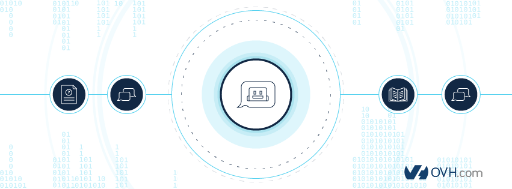

# OVH Chatbot - Node.js

   

The main goal of this tool is to help [OVH](https://ovh.com) clients in order to have faster responses when you have some problems with OVH services. For example for web hosting you can ask why your website is broken and then this chatbot will find a solution to fix that.

## Setup
Visit [INSTALL.md](INSTALL.md) to setup and test on Slack or Facebook.

## Project overview
+ [`bots`](bots/README.md) --> Represent all the modules about the bot's answers and it's specific type with an intention already given.
+ [`config`](config/README.md) --> The configuration of tools and configuration variables are in this directory.
+ [`constants`](constants/README.md) --> Represents the constants of the project.
+ [`controllers`](controllers/README.md) --> The controllers contain handler function of an express route.
+ [`diagnostics`](diagnostics/README.md) --> Contains all the modules for the diagnostics.
+ `models` --> Contains database models.
+ [`providers`](providers/README.md) --> Tools used globally in all the project.
+ `routes` --> Route declarations of the API.
+ [`platforms`](platforms/README.md) --> Contains all the handlers to communicate with different platforms.
+ [`utils`](utils/README.md) --> Contains all the utilities and API connector to make this chatbot works.
+ `views` --> Only to display a confirmations page when you logged in with your OVH account

## Supported platforms

### Facebook Messenger
This project handles callbacks for authentication, messages, delivery confirmation and postbacks. More details are available at the [Facebook Documentations](https://developers.facebook.com/docs/messenger-platform/webhook-reference).

### Slack
This project handles callbacks for authentication, messages and postback actions. More details are available at the [Slack Documentations](https://api.slack.com/).

### Web (OVH managers)
This project handles callbacks messages and postback actions. The authentication is handled by the managers.The bot *only* checks if the user is logged in or not.

## Bot functions

The bot uses [api.ai](https://www.api.ai) as a language processor.

### Responses/Intents

> To avoid confusions:
> + **Intent**: what the user *ask* to the bot.
> + **Response**: What the bot *respond* to an user.

All the intents needing dynamic responses can be found [here](bots/README.md). However, the responses to intents which doesn't need a dynamic response are stored in [api.ai](https://www.api.ai) database.

### Diagnostics
Currently, this bot is able to diagnose a website, a xdsl line or a phone line.
More details [here](diagnostics/README.md)

## Contributing

Have a look at the [Contributing section](CONTRIBUTING.md). If you have any question feel free to discuss about it  on our [Gitter](https://gitter.im/ovh/ux).

### Add a new platform [visit this page](platforms/README.md)

### Add a new intent and response [visit this page](bots/README.md)

### Add a new diagnostic [visit this page](diagnostics/README.md)

## Roadmap

+ Refactor to typescript
+ Docker compose
+ Documentation
+ Translations
+ When will my service expire?
+ Monitoring
+ Alerting

## License
See https://github.com/ovh-ux/ovh-chatbot/blob/master/LICENSE
